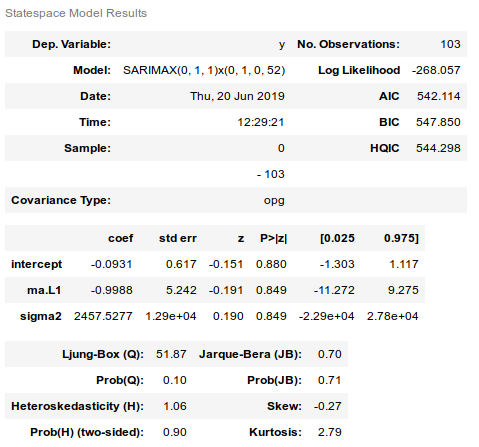
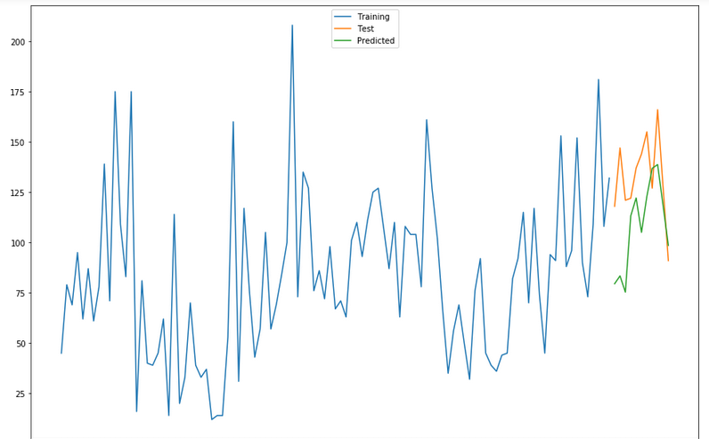
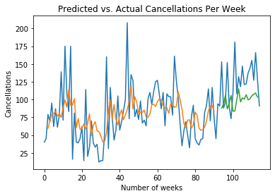
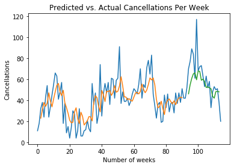

# Predicting Weekly Hotel Cancellations with an LSTM Network

As I discussed in a [previous post](https://www.michael-grogan.com/hotel-cancellations/), hotel cancellations can be problematic for businesses in the industry - cancellations lead to lost revenue, and this can also cause difficulty in coordinating bookings and adjusting revenue management practices.

Aside from analyzing which customers are less likely to cancel their bookings and allow hotels to amend their marketing strategy accordingly, it can also be useful to predict fluctuations in cancellations on a week-by-week basis in order for hotel chains to allocate capacity accordingly.

Previously, this was done using an ARIMA model to forecast cancellations for two separate hotel chains in Portugal. The ARIMA model achieved a mean directional accuracy of **80%**.

Here is the generated ARIMA model:



The following is a plot of the predicted versus actual cancellation values:



80% mean directional accuracy is reasonably good, but can an LSTM (long-short term memory network) do better?

LSTMs are sequential neural networks that assume dependence between the observations in a particular series. As such, they have increasingly come to be used for time series forecasting purposes.

In the last example, the cancellation data was already sorted into weekly values by pandas. Now, an LSTM will be used in place of ARIMA to predict cancellations for the test set, and ultimately see if an improvement in mean directional accuracy can be obtained.

Let’s begin the analysis for the H1 dataset. A dataset matrix is created and the data is scaled.

```
# Form dataset matrix
def create_dataset(df, previous=1):
    dataX, dataY = [], []
    for i in range(len(df)-previous-1):
        a = df[i:(i+previous), 0]
        dataX.append(a)
        dataY.append(df[i + previous, 0])
return np.array(dataX), np.array(dataY)
```

The data is then normalized with MinMaxScaler in order to allow the neural network to interpret it properly:

```
# normalize dataset with MinMaxScaler
scaler = MinMaxScaler(feature_range=(0, 1))
df = scaler.fit_transform(df)
df
```

Here is a sample of the output:

```
array([[0.14285714],
       [0.16836735],
       [0.34183673],
       [0.29081633],
       ...
       [0.78571429],
       [0.59183673],
       [0.40306122]])
```

The data is partitioned into training and test sets, with the *previous* parameter set to 2 - i.e. the cancellations at week *t* are being regressed against cancellations at *t-2*, and 150 epochs are used to train the model:

```
import tensorflow as tf
from tensorflow.keras import layers
from tensorflow.keras.layers import Dense
from tensorflow.keras.layers import LSTM

# Training and Test data partition
train_size = int(len(df) * 0.8)
test_size = len(df) - train_size
train, test = df[0:train_size,:], df[train_size:len(df),:]

# Number of previous
previous = 2
X_train, Y_train = create_dataset(train, previous)
X_test, Y_test = create_dataset(test, previous)

# reshape input to be [samples, time steps, features]
X_train = np.reshape(X_train, (X_train.shape[0], 1, X_train.shape[1]))
X_test = np.reshape(X_test, (X_test.shape[0], 1, X_test.shape[1]))

# Generate LSTM network
model = tf.keras.Sequential()
model.add(LSTM(4, input_shape=(1, previous)))
model.add(Dense(1))
model.compile(loss='mean_squared_error', optimizer='adam')
model.fit(X_train, Y_train, epochs=150, batch_size=1, verbose=2)
```

After 150 epochs are run, a loss of 0.0328 is yielded:

```
Epoch 147/150
89/89 - 0s - loss: 0.0329
Epoch 148/150
89/89 - 0s - loss: 0.0326
Epoch 149/150
89/89 - 0s - loss: 0.0327
Epoch 150/150
89/89 - 0s - loss: 0.0328
```

Now, let’s generate some predictions.

```
# Generate predictions
trainpred = model.predict(X_train)
testpred = model.predict(X_test)
```

Here is a sample of training and test predictions:

**Training Predictions**

```
>>> trainpred

array([[0.24308765],
       [0.29334682],
       [0.34213442],
       [0.34916055],
       [0.36314833],
       [0.33036196],
       [0.34789738],
       [0.3199189 ],
       [0.39131305]
...
```

**Test Predictions**

```
array([[0.3873779 ],
       [0.41535857],
       [0.47876447],
       [0.38130918],
       [0.4220309 ],
       [0.47831023],
       [0.36525652]
...
```

The predictions are converted back to normal values using ```scaler.inverse_transform```, and the training and test score is calculated.

```
import math
from sklearn.metrics import mean_squared_error

# calculate RMSE
trainScore = math.sqrt(mean_squared_error(Y_train[0], trainpred[:,0]))
print('Train Score: %.2f RMSE' % (trainScore))
testScore = math.sqrt(mean_squared_error(Y_test[0], testpred[:,0]))
print('Test Score: %.2f RMSE' % (testScore))
```

**Training and Test Scores**

```
Train Score: 35.26 RMSE
Test Score: 40.75 RMSE
```

Here is a plot of the predictions:



The test and prediction arrays are reshaped accordingly, and the function for *mean directional accuracy* is defined:

```
import numpy as np

def mda(actual: np.ndarray, predicted: np.ndarray):
    """ Mean Directional Accuracy """
return np.mean((np.sign(actual[1:] - actual[:-1]) == np.sign(predicted[1:] - predicted[:-1])).astype(int))
```

The mean directional accuracy is now calculated:

```
>>> mda(Y_test, predictions)
0.9
```

An MDA of **90%** is a significant improvement on the 80% that was previously yielded by the ARIMA model. Let’s see how LSTM performs on the H2 dataset.



```
>>> mda(Y_test, predictions)
0.9
```

An MDA of 90% is also yielded on the H2 dataset.

In this regard, we can see that LSTM appears to have been slightly more adept than ARIMA in modelling the volatility in hotel cancellations on a week-to-week basis.
